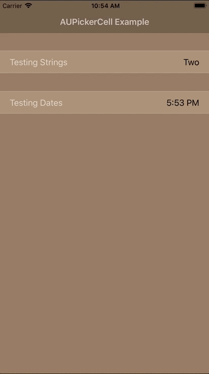

[](http://swift.org)
[](https://github.com/Carthage/Carthage)
[](https://cocoapods.org)
[](https://travis-ci.org/azizuysal/AUPickerCell)

# AUPickerCell

Embedded picker view for table cells.



## Requirements

AUPickerCell requires Swift 5.0 and Xcode 10.2.

## Installation

### CocoaPods

You can use [CocoaPods](https://cocoapods.org) to integrate AUPickerCell with your project.

Simply add the following line to your `Podfile`:

```ruby
pod "AUPickerCell"
```

And run `pod update` in your project directory.

### Carthage

[Carthage](https://github.com/Carthage/Carthage) is a decentralized dependency manager that builds your dependencies and provides you with binary frameworks.

You can install Carthage with [Homebrew](http://brew.sh/) using the following command:

```bash
brew update
brew install carthage
```

To integrate AUPickerCell into your Xcode project using Carthage, specify it in your `Cartfile`:

```yaml
github "azizuysal/AUPickerCell"
```

Run `carthage update` to build the framework and drag the built `AUPickerCell.framework` into your Xcode project.

### Manually

You can integrate AUPickerCell manually into your project simply by dragging `AUPickerCell.framework` onto Linked Frameworks and Libraries section in Xcode, or by copying `AUPickerCell.swift` source file in to your project.

## Usage

You can use AUPickerCell in your UITableView like any other UITableViewCell subclass:

```swift
override func tableView(_ tableView: UITableView, cellForRowAt indexPath: IndexPath) -> UITableViewCell {
  let cell = AUPickerCell(type: .default, reuseIdentifier: "TableCell")
  cell.values = ["One", "Two", "Three"]
  cell.selectedRow = 1
  cell.leftLabel.text = "Options"
  return cell
}
```

Afterwards, implement the following boilerplate in your `UITableViewDelegate` to support automatic cell expansion to display the picker:

```swift
override func tableView(_ tableView: UITableView, heightForRowAt indexPath: IndexPath) -> CGFloat {
  if let cell = tableView.cellForRow(at: indexPath) as? AUPickerCell {
    return cell.height
  }
  return super.tableView(tableView, heightForRowAt: indexPath)
}

override func tableView(_ tableView: UITableView, didSelectRowAt indexPath: IndexPath) {
  tableView.deselectRow(at: indexPath, animated: true)
  if let cell = tableView.cellForRow(at: indexPath) as? AUPickerCell {
    cell.selectedInTableView(tableView)
  }
}
```

The above example produces a cell with an embedded `UIPickerView` but you can just as easily create a cell with an embedded `UIDatePicker` by setting the picker `type` to `.date`, as below:

```swift
let cell = AUPickerCell(type: .date, reuseIdentifier: "PickerDateCell")
```

Upon user interaction, cell will auto update the right label text to reflect user's choice. You can also implement a delegate method to be notified of user's selection:

```swift
class MyViewController: UITableViewController, AUPickerCellDelegate {
  override func tableView(_ tableView: UITableView, cellForRowAt indexPath: IndexPath) -> UITableViewCell {
    let cell = AUPickerCell(type: .default, reuseIdentifier: "PickerDefaultCell")
    cell.delegate = self
    ...
  }
}

func auPickerCell(_ cell: AUPickerCell, didPick row: Int, value: Any) {
  self.pickedValue = value as! String
  ...
}
```

or, in the case of a date picker:

```swift
func auPickerCell(_ cell: AUPickerCell, didPick row: Int, value: Any) {
  self.pickedDate = value as! Date
  ...
}
```

## License

The MIT License (MIT)
